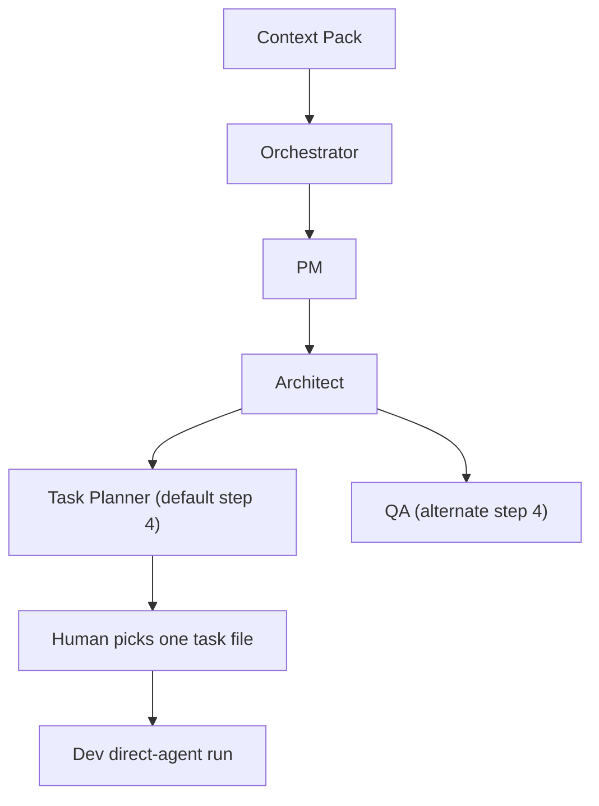

# Agent Studio v1

Status: Stable  
Mode: Human-in-the-loop

## Overview
Agent Studio v1 is the stable file-based CLI foundation for the project.

It uses repo files as source of truth, takes a context pack as the required execution input, and supports bounded role execution without relying on chat memory.

## What v1 Supports
- context-pack-driven execution
- repo-native loading of:
  - `AGENTS.md`
  - `system/agent-runner.md`
- mock local execution
- LLM execution with `OPENAI_API_KEY`
- direct agent execution
- state-aware prompts from `state/<context-pack-name>.md` when present
- artifact context support for direct agent execution
- selected task support for direct Dev execution
- lightweight post-execution quality checks
- bounded chaining:
  - `Orchestrator -> PM`
  - `Orchestrator -> PM -> Architect`
  - `Orchestrator -> PM -> Architect -> Task Planner`
  - `Orchestrator -> PM -> Architect -> QA`
- file-based logs and execution artifacts under `/logs/`
- human-selected task handoff under `/tasks/`

## Workflow Diagram


## Commands
Primary contract:
```bash
node ./bin/run-agent.js <context-pack-file>
```

Common examples:
```bash
node ./bin/run-agent.js context-packs/divya-runner-v1.md --execute
node ./bin/run-agent.js context-packs/divya-runner-v1.md --execute --llm
node ./bin/run-agent.js context-packs/divya-runner-v1.md --execute --llm --chain 3
node ./bin/run-agent.js context-packs/divya-runner-v1.md --execute --llm --chain 4
node ./bin/run-agent.js context-packs/divya-runner-v1.md --execute --llm --chain 4 --qa
node ./bin/run-agent.js context-packs/divya-runner-v1.md --agent architect --llm
node ./bin/run-agent.js context-packs/divya-runner-v1.md --agent qa --llm --with-artifact logs/<architect-output>.md
node ./bin/run-agent.js context-packs/divya-runner-v1.md --agent dev --llm --task tasks/T1-verify-runner-contract.md
```

## Human-In-The-Loop Flow
1. Create or update the context pack.
2. Run Orchestrator or a bounded chain.
3. If Task Planner is used, save tasks as `tasks/<task-id>.md`.
4. A human picks one task file.
5. Run Dev directly on that one task.
6. Review logs and continue with the next bounded execution.

## Intentionally Not Supported
- no unlimited chaining
- no chain longer than 4 steps
- no automatic `QA -> Task Planner` continuation in one run
- no Dev execution inside bounded chains
- no UI
- no async or background workflow execution
- no database or complex state system
- no auto-discovery and auto-execution loop for tasks
- no generalized workflow automation engine

## Known Next Milestones
- decide whether QA should remain a separate review endpoint or later feed a separate follow-up Task Planner run
- strengthen task-file conventions across Task Planner outputs
- improve Dev-task verification and handoff quality without expanding the chain model
- add more release-grade docs for stable operator workflows

## Source Of Truth
- `AGENTS.md`
- `system/agent-runner.md`
- `state/divya-runner-v1.md`
- `prompts/`
- `tasks/`
- `logs/`
